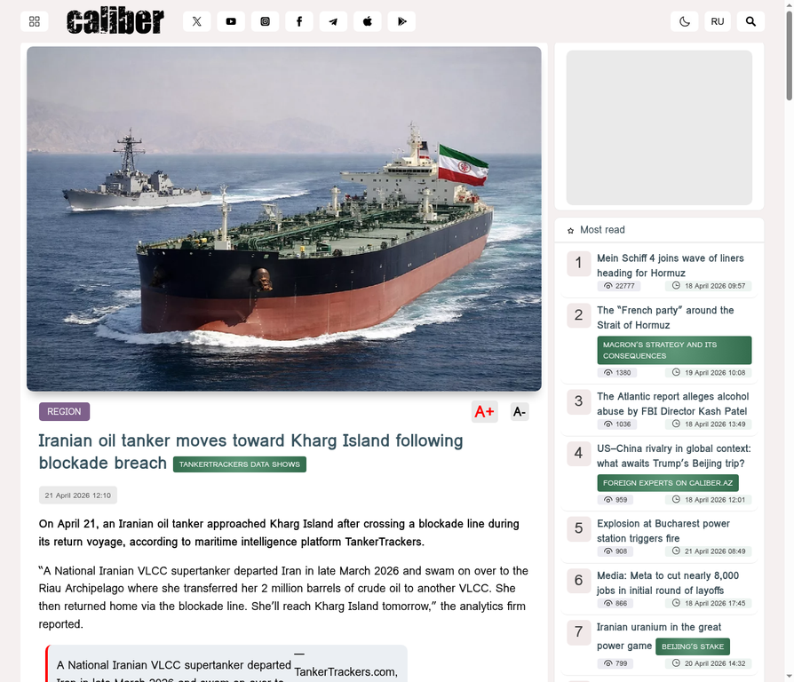
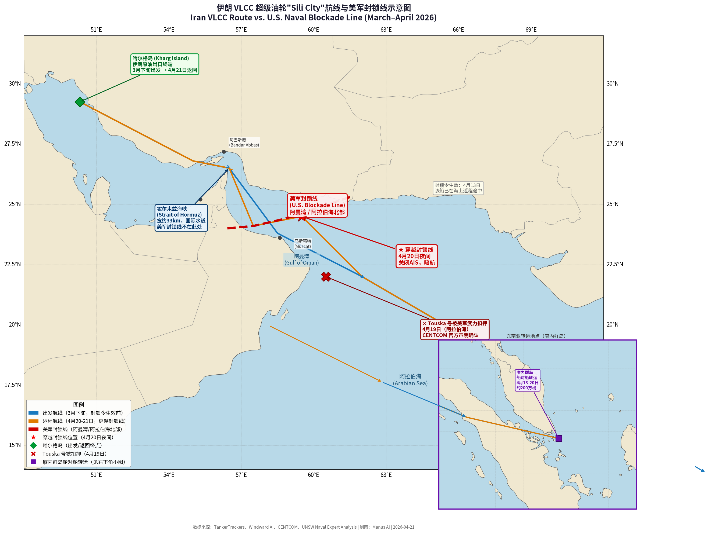
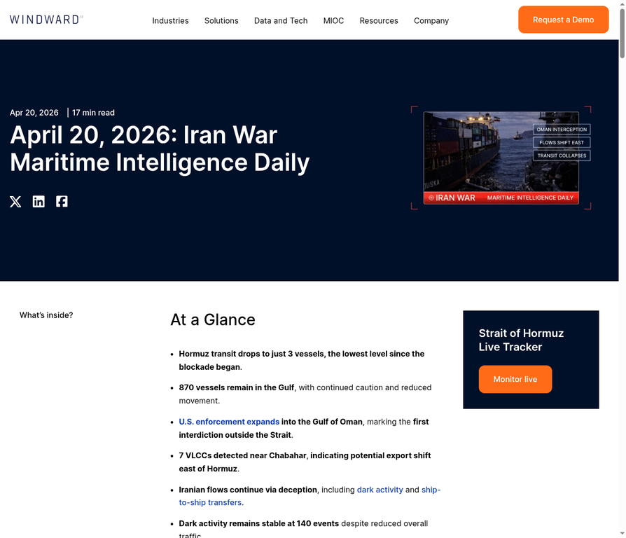
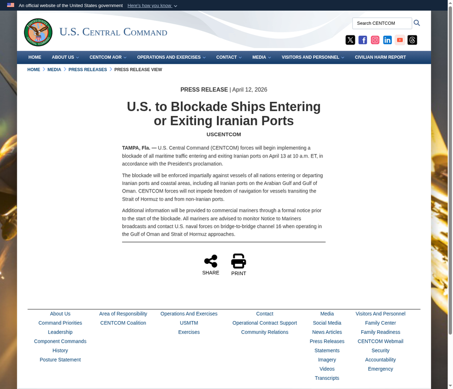
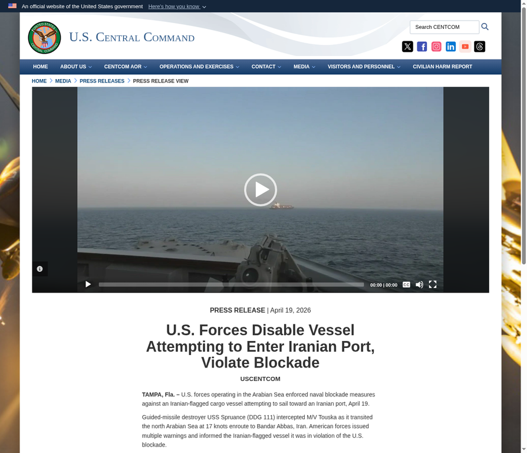
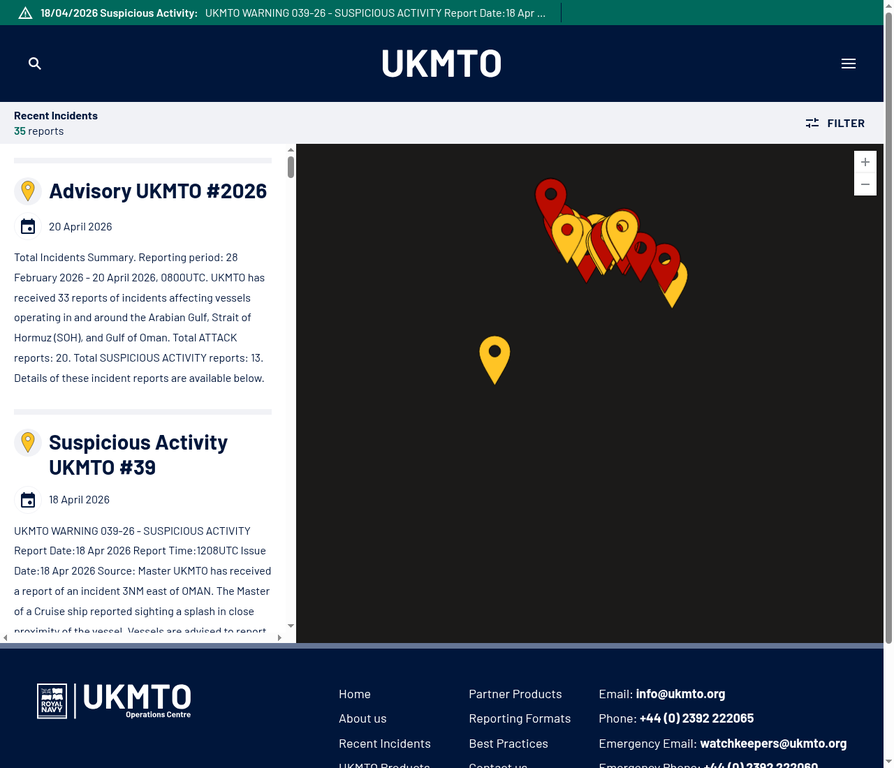
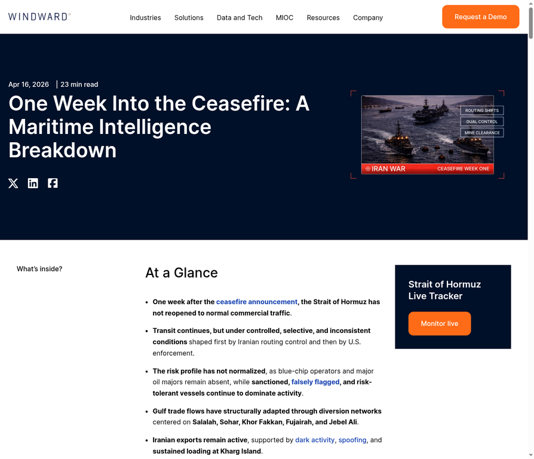

## 核心结论

经过对国际主流媒体、海事安全机构（UKMTO）、卫星情报机构（TankerTrackers、Windward AI）及美军官方声明（CENTCOM）的多层级独立核查，得出以下核心结论：

1. **物理事件属实**：确实有一艘伊朗国家石油公司（NITC）的VLCC超级油轮在4月20日夜间至21日凌晨穿越了美军封锁线返回伊朗哈尔格岛。
2. **"Sili City"身份存疑**："Sili City"这一船名仅存在于伊朗和俄罗斯媒体的报道中，在国际船舶数据库（VesselFinder、MarineTraffic）中无法查实，极大概率是为规避制裁而使用的虚假船名或临时名称。
3. **"强行突破"叙事不实**：没有任何第三方证据（包括美军声明和UKMTO警报）显示该船在穿越时遭遇了美军的"多次警告和威胁"或发生交火。该船是通过关闭AIS信号的"暗航"方式，利用美军执法的覆盖盲区悄悄穿越的。
4. **群体性现象**：这并非孤立事件。据劳氏日报（Lloyd's List）等机构统计，已有至少26艘伊朗"影子舰队"船只通过类似方式绕过了美军封锁。

---

## 一、事件时间线与航迹还原

根据专业海事卫星情报机构 TankerTrackers 的数据[^1]，该 VLCC 超级油轮的实际航行轨迹如下：

- **2026年3月下旬**：该船离开伊朗，前往东南亚。**此时美军封锁令尚未发布**。
- **4月13日**：美军正式实施针对进出伊朗港口船只的全面封锁[^2]。
- **4月13日至20日**：该船在印尼廖内群岛（Riau Archipelago）附近海域，通过"船对船转运"（STS），将约200万桶原油转移给另一艘 VLCC[^3]。
- **4月20日夜间至21日凌晨**：该船在返程途中，穿越了美军设立的封锁线，进入伊朗领海。
- **4月21日**：该船预计抵达伊朗哈尔格岛（Kharg Island）原油出口终端。

**分析**：这艘船并非为了"挑战封锁"而专门出航，而是在执行一次耗时数周的常规原油走私任务（出发、转运、返程）。其返程时间恰好与美军封锁令生效时间重合。

---

## 二、封锁线在哪里？——这艘船确实经过了霍尔木兹海峡

许多媒体报道给人一种印象：美军封锁线设在霍尔木兹海峡内部。**这是错误的。**

根据新南威尔士大学（UNSW）海军法专家 Jennifer Parker 的权威分析[^10]：

> 美军并不是在霍尔木兹海峡内设立封锁线。他们的军舰部署在更靠后的位置——**阿曼湾和阿拉伯海北部**，封锁线实际上划在伊朗-巴基斯坦边界到阿曼-阿联酋边界之间的海域。

这意味着：

| 地理位置 | 与封锁的关系 |
|---|---|
| **霍尔木兹海峡** | 国际水道，最窄处仅约33公里。美军**无权**在此设立封锁线，否则将影响沙特、伊拉克、科威特等中立国港口，违反国际法。 |
| **阿曼湾 / 阿拉伯海北部** | **美军封锁线的实际位置**。海域极其广阔（数十万平方公里），美军仅凭有限舰艇无法做到密不透风。 |

这艘 VLCC 的实际穿越路线是：**印尼廖内群岛 → 阿拉伯海 → 穿越美军在阿曼湾的封锁线 → 进入霍尔木兹海峡 → 波斯湾 → 哈尔格岛**。它穿越的"封锁线"在阿曼湾，而不是在霍尔木兹海峡内部。**封锁线的位置本身，就是它能穿越的最根本原因——因为阿曼湾太宽了，守不住。**

---

## 三、它是怎么穿越的？美军的盲区在哪？

该船能够成功穿越，基于以下三个层面的原因：

### 3.1 "暗航"与欺骗性航运操作

伊朗"影子舰队"广泛使用关闭船舶自动识别系统（AIS）、位置欺骗（Spoofing）等手段。Windward AI 的海事情报显示，仅在4月20日当天，海湾地区就记录了**140起"暗活动"（Dark Activity）事件**[^5]。美军在没有 AIS 信号引导的情况下，仅靠雷达和卫星搜索广阔的阿拉伯海和阿曼湾，极易出现漏网之鱼。

关闭 AIS 后，一艘 VLCC 在夜间的雷达截面虽然很大，但在数十万平方公里的海域中，美军巡逻舰艇的雷达探测范围有限（通常为数十海里），不可能覆盖整条封锁线。

### 3.2 封锁令的法律文本与执法重心偏移

美国中央司令部（CENTCOM）的封锁令明确规定："封锁将针对所有国籍的**进入或驶离伊朗港口**的船只"[^2]。虽然这艘 VLCC 的最终目的地是伊朗港口，但其航行起点是东南亚公海，且返程时已经卸完原油，是**空载**状态。

在实际操作中，美军的执法资源主要集中在两个方向：

| 执法重心 | 说明 |
|---|---|
| **拦截驶离伊朗港口的重载油轮** | 这些船携带伊朗原油出口，是制裁打击的核心目标 |
| **在霍尔木兹海峡附近的咽喉要道拦截** | 利用海峡的狭窄地形提高拦截效率 |

对于在广阔大洋上返程的空载油轮，拦截优先级较低——因为它既没有携带伊朗原油，也不在咽喉要道附近。

### 3.3 执法资源的牵扯：Touska 号事件

就在该 VLCC 穿越前后的**4月19日**，美军将大量兵力和指挥注意力集中在武力扣押伊朗籍集装箱船"Touska"号上[^6]。这是封锁实施以来美军**首次动用武力**进行登船检查（向 Touska 号机舱开火使其停船），客观上为其他"影子舰队"船只创造了穿越的窗口期。

这就好比警察正在追捕一名嫌疑人，而另一名嫌疑人趁机从另一条路溜走了。

---

## 四、是否发生了交火？

**结论：没有交火，甚至可能没有任何实质性接触。**

伊朗官方声明称该船"在美军的多次警告和威胁下强行突破"[^4]，但这一说法缺乏任何第三方证据支持：

| 核查项 | 结果 |
|---|---|
| **CENTCOM 官方声明** | **完全沉默**。至今未发布任何关于警告或拦截该 VLCC 的声明。相比之下，拦截 Touska 号时，美军第一时间发布了详细的新闻稿、照片和视频。 |
| **UKMTO 海事警报** | **零报告**。4月19日和20日，该海域没有任何新增的安全事件或袭击报告[^7]。 |
| **伊朗声明的细节** | 称"受到多次警告和威胁"，但**未提供任何具体细节**——没有时间、没有坐标、没有美军舰艇番号、没有无线电通话记录。 |
| **第三方媒体核实** | news.az 等媒体明确注明"**no independent confirmation was provided**"（未获独立确认）。半岛电视台转述伊朗声明时也未独立核实。 |

CENTCOM 对此事件的完全沉默本身就是最有力的证据：如果美军确实向这艘船发出了警告但被无视，这将是一次严重的执法失败，美军不可能不回应。更可能的解释是——**美军根本没有发现或接触到这艘船**。

---

## 五、只有这一艘船穿越了吗？——不，至少26艘

"Sili City"的穿越**并非孤例**，而是一个群体性现象。这也解释了为什么这艘船并不"显眼"——因为它只是众多穿越者中的一个。

根据国际权威航运媒体《劳氏日报》（Lloyd's List）的统计，自美军封锁令生效以来，已有**至少26艘**隶属于伊朗"影子舰队"的船只（这些船只多处于美国或欧洲制裁名单中）成功绕过了美军的封锁[^8]。

此外，Kpler 卫星数据还确认，早在4月16日（封锁生效仅3天后），就有三艘伊朗制裁油轮（Deep Sea、Sonia I、Diona）通过关闭 AIS 的方式穿越了霍尔木兹海峡离开波斯湾[^11]。

这些船只普遍采用了复杂的规避策略，Windward AI 的报告指出，伊朗原油出口仍在继续，主要依赖于"暗活动、位置欺骗以及在哈尔格岛的持续装载"[^9]。

| 穿越方式 | 说明 |
|---|---|
| **关闭 AIS** | 最基本的规避手段，使船只从全球追踪系统中"消失" |
| **位置欺骗（GPS Spoofing）** | 发送虚假位置信号，使追踪系统显示船只在其他位置 |
| **频繁更名换旗** | 同一艘船使用多个名称和旗国注册，增加识别难度 |
| **船对船转运（STS）** | 在公海上将货物转移给另一艘船，切断与伊朗的直接关联 |
| **夜间穿越** | 利用夜间视觉侦察能力下降的窗口 |

---

## 六、综合分析结论

综合上述核查结果，俄罗斯《消息报》和伊朗官方媒体关于"Sili City"号油轮事件的报道，是一个典型的**"基于部分真实物理事件的夸大信息战"**。

| 维度 | 真实情况 | 伊朗/俄媒叙事 |
|---|---|---|
| **是否有船穿越** | 是，有一艘 NITC 的 VLCC 穿越了封锁线 | 是（这部分属实） |
| **船名"Sili City"** | 国际数据库中无法查实 | 作为确定事实报道 |
| **穿越方式** | 关闭 AIS 暗航，利用美军覆盖盲区悄悄溜过 | "在美军多次威胁下强行突破" |
| **是否有交火/对峙** | 无任何第三方证据 | 暗示存在激烈对抗 |
| **是否为孤立事件** | 否，至少26艘船以类似方式穿越 | 包装为独一无二的英雄壮举 |
| **出发目的** | 3月下旬出发的常规走私任务，返程碰上封锁 | 暗示为专门挑战封锁 |

**最终判定**：该事件的物理基础（有船穿越）是真实的，但伊朗军方和俄罗斯媒体对其进行了系统性的叙事包装，将一次低调的制裁规避行动塑造为高调的"英雄主义突破"，目的是对冲同日"Touska"号被美军武力扣押带来的舆论压力，并在国际上展示美军封锁的"无效性"。

---

## 参考来源

[^1]: Caliber.az. (2026). *Iranian oil tanker moves toward Kharg Island following blockade breach - TankerTrackers data shows*. [链接](https://www.caliber.az/en/post/iranian-oil-tanker-moves-toward-kharg-island-following-blockade-breach)

[^2]: U.S. Central Command. (2026). *U.S. to Blockade Ships Entering or Exiting Iranian Ports*. [链接](https://www.centcom.mil/MEDIA/PRESS-RELEASES/Press-Release-View/Article/4457255/us-to-blockade-ships-entering-or-exiting-iranian-ports/)

[^3]: Sunday Guardian Live. (2026). *Did Iran Breach US Naval Blockade? Tanker Slips Past 'Siege Line' After 2 Million Barrel Oil Transfer*. [链接](https://sundayguardianlive.com/world/us-israel-iran-war-latest-update-did-iran-breach-us-naval-blockade-tanker-slips-past-siege-line-after-2-million-barrel-oil-transfer-185509/)

[^4]: Roya News. (2026). *Iran claims tanker breached US blockade despite 'threats'*. [链接](https://en.royanews.tv/news/69121/Iran-claims-tanker-breached-US-blockade-despite-'threats')

[^5]: Windward AI. (2026). *April 20, 2026: Iran War Maritime Intelligence Daily*. [链接](https://windward.ai/blog/april-20-maritime-intelligence-daily/)

[^6]: U.S. Central Command. (2026). *U.S. Forces Disable Vessel Attempting to Enter Iranian Port, Violate Blockade*. [链接](https://www.centcom.mil/MEDIA/PRESS-RELEASES/Press-Release-View/Article/4464037/us-forces-disable-vessel-attempting-to-enter-iranian-port-violate-blockade/)

[^7]: UKMTO. (2026). *Recent Incidents*. [链接](https://www.ukmto.org/recent-incidents)

[^8]: Lloyd's List / Iran International. (2026). *At least 26 Iranian shadow fleet vessels have bypassed the blockade*. [链接](https://www.iranintl.com/en/202604205654)

[^9]: Windward AI. (2026). *Hormuz Ceasefire Week One Maritime Intelligence Update*. [链接](https://windward.ai/blog/one-week-into-the-ceasefire/)

[^10]: UNSW Newsroom. (2026). *Both the US and Iran are firing on commercial ships in the Strait of Hormuz. Are both sides acting lawfully?*. [链接](https://www.unsw.edu.au/newsroom/news/2026/04/both-the-us-and-iran-are-firing-on-commercial-ships-in-the-strait-of-hormuz-are-both-sides-acting-lawfully)

[^11]: Kurdistan24. (2026). *Three sanctioned Iranian oil tankers exit Gulf amid US blockade*. [链接](https://www.kurdistan24.net/en/story/908606/three-sanctioned-iranian-oil-tankers-exit-gulf-amid-us-blockade)
